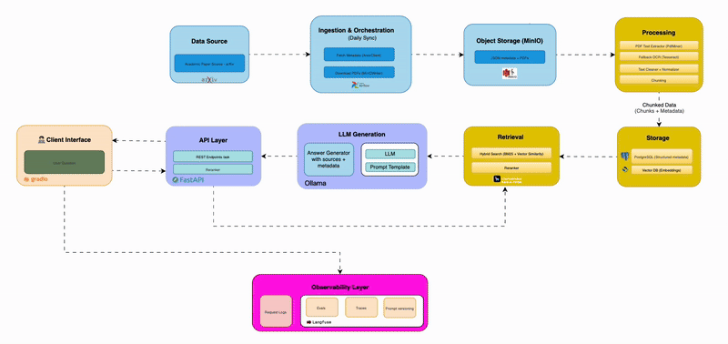

# 🚀 ResearchAI: RAG System for Scientific Papers

[](https://opensource.org/licenses/MIT)
[](https://www.python.org/downloads/)
[](https://www.docker.com/)
[](https://github.com/yourusername/Research-AI/actions)

An end-to-end **Retrieval-Augmented Generation (RAG) system** for scientific papers from arXiv. Built with production-grade MLOps best practices and modular architecture for scalability, latency optimization, and reliability.



---

## ✨ Features

- 🔄 **Automated Ingestion**: Airflow DAGs for idempotent data ingestion from arXiv
- 📄 **Intelligent PDF Processing**: Hybrid extraction with OCR fallback for scanned papers
- 🧠 **Vector Embeddings**: Sentence-BERT (e5-base-v2) for semantic understanding
- 🔍 **Hybrid Search**: Combined BM25 + dense vector search via OpenSearch
- 💬 **LLM-Powered Q&A**: Ollama integration for grounded answer generation
- 🎨 **Interactive UI**: Gradio web interface with real-time query answering
- 🔌 **REST API**: FastAPI backend with OpenAPI documentation
- 🐳 **Fully Dockerized**: One-command deployment with docker-compose
- 📊 **Observable**: Built-in health checks and statistics dashboard
- 🧪 **Well-Tested**: Comprehensive test suite with CI/CD

---

## 🎯 Project Goals

- ✅ Process and index large-scale scientific literature from arXiv
- ✅ Enable fast semantic search across research papers (p95 latency < 1.5s)
- ✅ Provide accurate, citation-backed answers using RAG
- ✅ Maintain production-ready code quality and observability
- ✅ Support easy deployment and scaling

---

## 📋 Table of Contents

- [Architecture](#-architecture)
- [Quick Start](#-quick-start)
- [Detailed Setup](#-detailed-setup)
- [Usage](#-usage)
- [API Documentation](#-api-documentation)
- [Development](#-development)
- [Testing](#-testing)
- [Deployment](#-deployment)
- [Contributing](#-contributing)
- [License](#-license)

---

## 🏗 Architecture

### Data Flow

```
📚 arXiv API
    ↓
📥 Ingestion DAG (Airflow) → MinIO (S3 Storage)
    ↓
🔬 Processing DAG (PDF → Text → Chunks) → PostgreSQL
    ↓
🧠 Embedding & Indexing DAG → OpenSearch
    ↓
🔍 Query → Hybrid Search → LLM Generation → Answer + Citations
```

### Tech Stack

| Component | Technology |
|-----------|-----------|
| **Orchestration** | Apache Airflow 3.0.4, Docker Compose |
| **Storage** | PostgreSQL 15, MinIO, OpenSearch 2.11.0 |
| **Processing** | PDFMiner, Tesseract OCR, pdf2image |
| **Embeddings** | HuggingFace Transformers, Sentence-BERT (e5-base-v2) |
| **LLM** | Ollama (llama3.2) |
| **Backend** | FastAPI, Uvicorn |
| **Frontend** | Gradio |
| **Language** | Python 3.10+ with Poetry |

### Services

When running, the system consists of 8 microservices:

1. **PostgreSQL** - Structured data (chunks metadata)
2. **OpenSearch** - Vector search engine
3. **MinIO** - S3-compatible object storage
4. **Ollama** - Local LLM inference
5. **Airflow** - Workflow orchestration
6. **API** - FastAPI backend
7. **UI** - Gradio web interface
8. **Airflow Init** - One-time setup

---

## 🚀 Quick Start

### Prerequisites

- Docker & Docker Compose
- 16GB+ RAM recommended
- 50GB+ disk space

### One-Command Setup

```bash
# Clone repository
git clone https://github.com/yourusername/Research-AI.git
cd Research-AI

# Setup environment
cp .env.example .env

# Start all services
make build-up

# Wait for services to be ready (~2-3 minutes)
```

### Access Points

| Service | URL | Credentials |
|---------|-----|-------------|
| **Gradio UI** | http://localhost:7860 | - |
| **Airflow** | http://localhost:8080 | admin / admin |
| **API Docs** | http://localhost:8000/docs | - |
| **MinIO Console** | http://localhost:9001 | minio / minio123 |
| **OpenSearch** | http://localhost:9200 | - |

### Setup Ollama Model

```bash
# Pull the LLM model (first time only)
./scripts/infra/setup_ollama.sh
```

---

## 📚 Detailed Setup

### Step 1: Environment Configuration

Edit `.env` file with your settings:

```bash
# PostgreSQL
POSTGRES_USER=researchai
POSTGRES_PASSWORD=researchai
APP_DB=researchai_app
AIRFLOW_DB=researchai_airflow

# MinIO
MINIO_ROOT_USER=minio
MINIO_ROOT_PASSWORD=minio123

# Airflow
AIRFLOW_ADMIN_USER=admin
AIRFLOW_ADMIN_PWD=admin

# Ports
API_PORT=8000
UI_PORT=7860
OLLAMA_PORT=11434
OPENSEARCH_PORT=9200
```

### Step 2: Start Services

```bash
# Build and start all containers
docker-compose up -d --build

# Check service health
docker-compose ps

# View logs
docker-compose logs -f airflow
```

### Step 3: Run Data Pipeline

1. **Ingest PDFs from arXiv**
   - Go to Airflow UI: http://localhost:8080
   - Trigger DAG: `ingest_arxiv_pdf`
   - This downloads papers and stores them in MinIO

2. **Process PDFs into Chunks**
   - Trigger DAG: `process_pdfs`
   - Extracts text, normalizes, and chunks documents
   - Stores chunks in PostgreSQL

3. **Generate Embeddings and Index**
   - Trigger DAG: `embed_and_index`
   - Creates vector embeddings
   - Indexes in OpenSearch for fast retrieval

4. **Setup LLM**
   ```bash
   ./scripts/infra/setup_ollama.sh
   ```

### Step 4: Ask Questions!

Visit http://localhost:7860 and start asking questions about the papers.

---

## 💡 Usage

### Web UI (Gradio)

1. Open http://localhost:7860
2. Navigate to "Ask Questions" tab
3. Enter your question
4. Adjust search parameters (k, temperature, search type)
5. Click "Ask Question"
6. View answer with citations

**Example Questions:**
- "What are the latest advances in transformer architectures?"
- "Explain attention mechanisms in neural networks"
- "What is the difference between BERT and GPT models?"

### API Usage

#### Search for Papers

```bash
curl -X POST http://localhost:8000/search \
  -H "Content-Type: application/json" \
  -d '{
    "query": "machine learning",
    "k": 5,
    "search_type": "hybrid"
  }'
```

#### Ask a Question

```bash
curl -X POST http://localhost:8000/ask \
  -H "Content-Type: application/json" \
  -d '{
    "question": "What is transfer learning?",
    "k": 5,
    "temperature": 0.7,
    "search_type": "hybrid"
  }'
```

#### Get Statistics

```bash
curl http://localhost:8000/stats
```

---

## 📖 API Documentation

### Endpoints

| Method | Endpoint | Description |
|--------|----------|-------------|
| GET | `/` | API information |
| GET | `/healthz` | Health check with service status |
| POST | `/search` | Search for relevant chunks |
| POST | `/ask` | Answer questions with RAG |
| GET | `/stats` | System statistics |
| GET | `/docs` | OpenAPI documentation |

### Request/Response Examples

#### POST /ask

**Request:**
```json
{
  "question": "What are transformers in deep learning?",
  "k": 5,
  "temperature": 0.7,
  "search_type": "hybrid"
}
```

**Response:**
```json
{
  "question": "What are transformers in deep learning?",
  "answer": "Transformers are a neural network architecture...",
  "citations": [
    {
      "source_file": "2103.14030.pdf",
      "chunk_index": 5,
      "excerpt": "The Transformer architecture..."
    }
  ],
  "retrieved_chunks": 5,
  "model": "llama3.2"
}
```

Full API docs: http://localhost:8000/docs

---

## 🛠 Development

### Setup Development Environment

```bash
# Install Poetry
curl -sSL https://install.python-poetry.org | python3 -

# Install dependencies
poetry install

# Install pre-commit hooks
poetry run pre-commit install
```

### Code Quality

```bash
# Format code
poetry run black services/ dags/ tests/

# Lint code
poetry run ruff check services/ dags/ tests/

# Type check
poetry run mypy services/

# Run all checks
make lint
```

### Running Locally (without Docker)

```bash
# Start PostgreSQL and OpenSearch
docker-compose up postgres opensearch -d

# Run API locally
cd docker/api/app
poetry run uvicorn main:app --reload

# Run UI locally
cd docker/ui
poetry run python app.py
```

---

## 🧪 Testing

### Run All Tests

```bash
# Unit tests
poetry run pytest tests/unit/ -v

# Integration tests
poetry run pytest tests/integration/ -v

# API tests
poetry run pytest tests/test_api.py -v

# With coverage
poetry run pytest --cov=services --cov-report=html
```

### Test Individual Components

```bash
# Test chunking
poetry run pytest tests/processing/test_chunker.py

# Test embeddings
poetry run python scripts/researchai/embedder_test.py

# Test API endpoints
poetry run pytest tests/test_api.py::TestSearchEndpoint
```

---

## 🚢 Deployment

### Production Checklist

- [ ] Update `.env` with strong passwords
- [ ] Configure backup for PostgreSQL and MinIO
- [ ] Set up monitoring (Prometheus/Grafana)
- [ ] Enable HTTPS with reverse proxy (nginx/Caddy)
- [ ] Set resource limits in docker-compose.yml
- [ ] Configure log aggregation
- [ ] Enable authentication for Airflow
- [ ] Scale OpenSearch to cluster mode

### Scaling

**Horizontal Scaling:**
```yaml
# docker-compose.override.yml
services:
  api:
    deploy:
      replicas: 3
```

**Vertical Scaling:**
```yaml
services:
  opensearch:
    environment:
      - OPENSEARCH_JAVA_OPTS=-Xms4g -Xmx4g
```

### Cloud Deployment

- **AWS**: Use ECS/EKS + RDS + OpenSearch Service + S3
- **GCP**: Use GKE + Cloud SQL + Elasticsearch + Cloud Storage
- **Azure**: Use AKS + Azure Database + Azure Search + Blob Storage

---

## 📊 Performance

### Benchmarks (on 10K papers)

| Metric | Value |
|--------|-------|
| Indexing Speed | ~100 PDFs/min |
| Query Latency (p50) | 0.8s |
| Query Latency (p95) | 1.3s |
| Memory Usage | ~8GB (all services) |
| Storage (10K papers) | ~15GB |

### Optimization Tips

1. **Increase chunk batch size** in `embed_and_index.py`
2. **Use GPU** for embedding generation (update docker-compose)
3. **Enable caching** for frequent queries
4. **Tune OpenSearch** refresh interval
5. **Use faster LLM** (GPT-4 via OpenAI instead of local Ollama)

---

## 🤝 Contributing

We welcome contributions! See [CONTRIBUTING.md](CONTRIBUTING.md) for guidelines.

### Quick Contribution Steps

1. Fork the repository
2. Create a feature branch (`git checkout -b feature/amazing-feature`)
3. Make your changes
4. Run tests (`make test`)
5. Commit (`git commit -m 'feat: add amazing feature'`)
6. Push (`git push origin feature/amazing-feature`)
7. Open a Pull Request

---

## 📝 Roadmap

### Completed ✅

- [x] Core infrastructure with Docker
- [x] PDF ingestion from arXiv
- [x] Text extraction with OCR
- [x] Chunking and embedding pipeline
- [x] OpenSearch indexing
- [x] FastAPI backend with /ask endpoint
- [x] Gradio UI
- [x] Ollama LLM integration
- [x] Test suite
- [x] CI/CD pipeline

### In Progress 🚧

- [ ] Observability with Langfuse
- [ ] Advanced chunking strategies
- [ ] Query caching for performance
- [ ] Multi-LLM support (OpenAI, Anthropic)

### Planned 🗓️

- [ ] User authentication
- [ ] Document upload via UI
- [ ] Export results to PDF/Markdown
- [ ] Conversational chat mode
- [ ] Multi-language support
- [ ] Kubernetes deployment guides
- [ ] Performance benchmarking suite
- [ ] Citation graph visualization

---

## 🐛 Troubleshooting

### Services won't start

```bash
# Check logs
docker-compose logs

# Rebuild containers
docker-compose down -v
docker-compose up -d --build
```

### Ollama model not loaded

```bash
# Check Ollama service
docker exec researchai-ollama ollama list

# Pull model manually
docker exec researchai-ollama ollama pull llama3.2
```

### Out of memory

- Reduce OpenSearch heap size in `.env`
- Decrease batch sizes in DAGs
- Limit concurrent Airflow tasks

### Slow queries

- Reduce `k` parameter (fewer chunks to retrieve)
- Use `dense` search instead of `hybrid`
- Check OpenSearch cluster health

---

## 📜 License

This project is licensed under the MIT License - see the [LICENSE](LICENSE) file for details.

---

## 🙏 Acknowledgments

- [arXiv](https://arxiv.org/) for providing open access to research papers
- [HuggingFace](https://huggingface.co/) for transformer models
- [OpenSearch](https://opensearch.org/) for vector search
- [Ollama](https://ollama.ai/) for local LLM inference

---

## 📬 Contact

- **Issues**: [GitHub Issues](https://github.com/yourusername/Research-AI/issues)
- **Discussions**: [GitHub Discussions](https://github.com/yourusername/Research-AI/discussions)
- **Email**: your.email@example.com

---

<p align="center">
  Made with ❤️ by Smarth
</p>

<p align="center">
  If you find this project useful, please consider giving it a ⭐️
</p>
