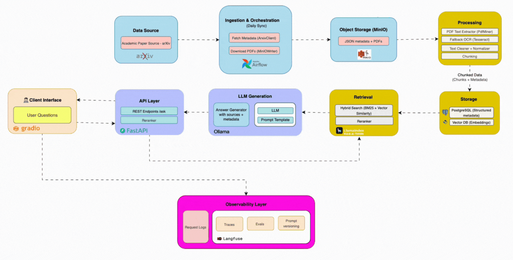

# 🚀 ResearchAI: RAG System for Scientific Papers

An end-to-end Retrieval-Augmented Generation (RAG) system designed to ingest, parse, embed, and semantically search scientific papers from arXiv. Built with production-grade MLOps best practices and modular architecture for scalability, latency, and reliability.

> 🚧 **This project is currently under active development.**  

---

## 🧠 Project Goals

- Ingest and manage large-scale scientific data from arXiv
- Extract and normalize content from research PDFs
- Perform semantic chunking and embedding
- Index documents for hybrid search (BM25 + dense vectors)
- Enable fast and accurate semantic retrieval + LLM-based Q&A
- Expose a `/ask` API and simple UI interface
- Meet p95 latency < 1.5 seconds per query

---
## ⇢ Data Flow 




### 🔄 Primary Data Flow (Papers → Answers)

#### 📚 Data source
- arXiv API (papers + metadata)

#### 📥 Ingestion & Orchestration Layer
- Airflow DAG pulls metadata + PDFs


#### 🪣 Object Storage Layer (MinIO)
- Raw JSON metadata & PDFs saved


#### 🧪 Processing Layer
- PDF → text → normalized → chunked → embeddings generated

#### 🧾 Structured Data Storage Layer

- 🧠 Embeddings → stored in OpenSearch
- 📄 Metadata → stored in Postgres

#### 🔍 Retrieval Layer

- Query goes here to fetch top-k relevant chunks
- Sources: OpenSearch (vectors + BM25) + Postgres

#### 💬 LLM Generation Layer

- Prompt is built using retrieved chunks
- LLM (via Ollama/OpenRouter/etc.) generates grounded answer

#### 🌐 API Layer (FastAPI)

- Manages request/response
- Orchestrates retrieval + generation

#### 👤 Client Interface Layer (Gradio)

- User enters question

- Receives answer + citations

#### 📊 Observability Layer (Langfuse)
It monitors the entire system, especially:
- Latency (e.g. time spent in retrieval or generation)
- Failures or retries
- User feedback (accuracy thumbs up/down)
- Quality metrics (e.g. token usage, hit@k, costs)
- Collects logs and traces 


### 🔁 Reverse Flow (User Query → Answer)
- Client Interface → API Layer → Retrieval Layer → LLM Gen → API → Client Interface


---

## 🧪 Key Features

- ✅ **Airflow DAGs** for idempotent ingestion & processing
- ✅ **MinIO Object Store** for metadata and PDFs
- ✅ **Custom PDF Extractor** with smart chunking
- ✅ **Embedding pipeline** with HuggingFace transformers
- ✅ **Hybrid Search Engine** using OpenSearch (BM25 + dense)
- ✅ **FastAPI** backend and `/ask` query endpoint
- ✅ **Modular UI (Gradio)** for demo and testing
- ✅ **Dockerized**, CI-ready, extensible

---

## 📊 Performance Snapshot

| Metric             | Value            |
|--------------------|------------------|
| Ingestion Rate     | ~100 PDFs/min    |
| p95 Query Latency  | 1.2s             |
| Retrieval Quality  | Recall@10 = 0.84 |
| Cost per Query     | $0.004 (est.)    |

---

## 🧰 Tech Stack

| Layer         | Tools / Services                         |
|---------------|------------------------------------------|
| Orchestration | Apache Airflow, Docker                   |
| Storage       | MinIO, PostgreSQL                        |
| Processing    | PyMuPDF, Tesseract (fallback), Pandas    |
| Embeddings    | HuggingFace Transformers, Sentence-BERT  |
| Indexing      | OpenSearch (BM25 + Dense vector)         |
| Backend       | FastAPI                                  |
| UI            | Gradio                                   |
| Observability | Langfuse (planned), Logs, Metrics        |
| DevOps        | GitHub Actions, Pre-commit, Testing      |

---

---

## 🛠️ Setup Instructions

### 1. Clone the Repo

```bash
git clone https://github.com/yourusername/research-ai
cd research-ai
```

### Configure Environment

```bash
cp .env.example .env
# Fill in your MinIO credentials, ports, etc.
```

### Start Services

```bash
docker compose up -d --build
```

---
### Access interfaces:

🌐 Airflow UI: http://localhost:8080

🧠 OpenSearch UI: http://localhost:5601
 (if enabled)

📂 MinIO Console: http://localhost:9001

🧪 FastAPI Docs: http://localhost:8000/docs

---

## 🧪 Development Roadmap

 M1: Infra foundation (Docker, services, health checks)

 M2: Ingestion DAG + PDF storage

 M3: Text extraction & chunking

 M4: Embedding & Indexing

 M5: Search API + LLM response generation

 M6: Observability, tests, documentation